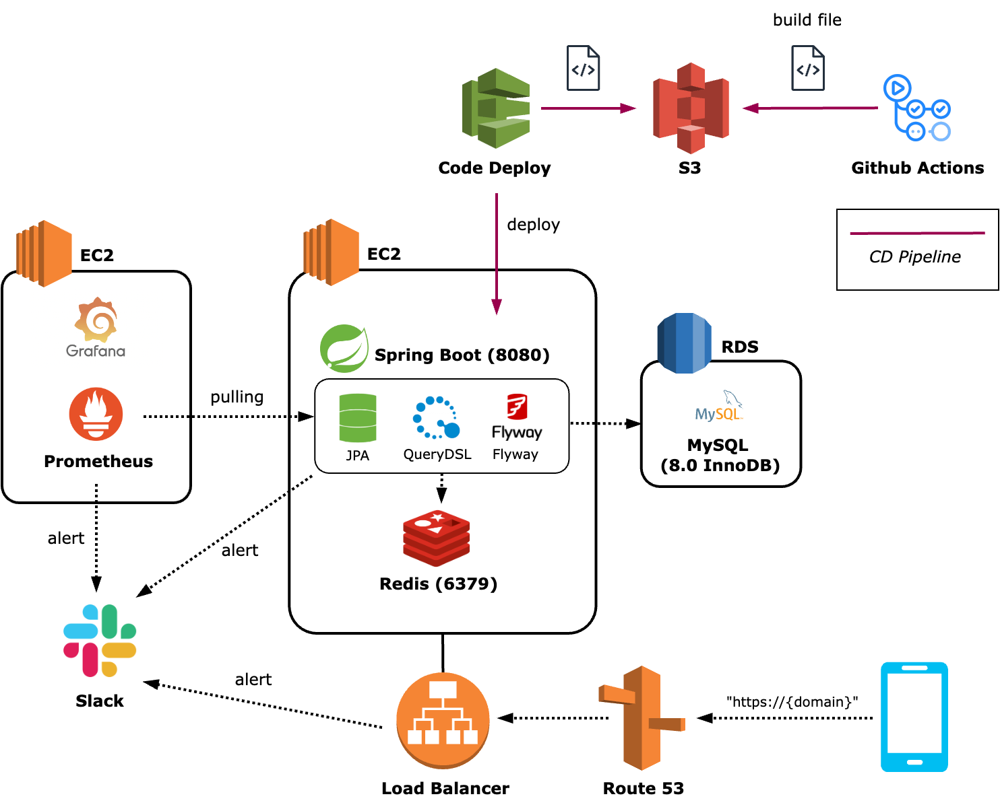
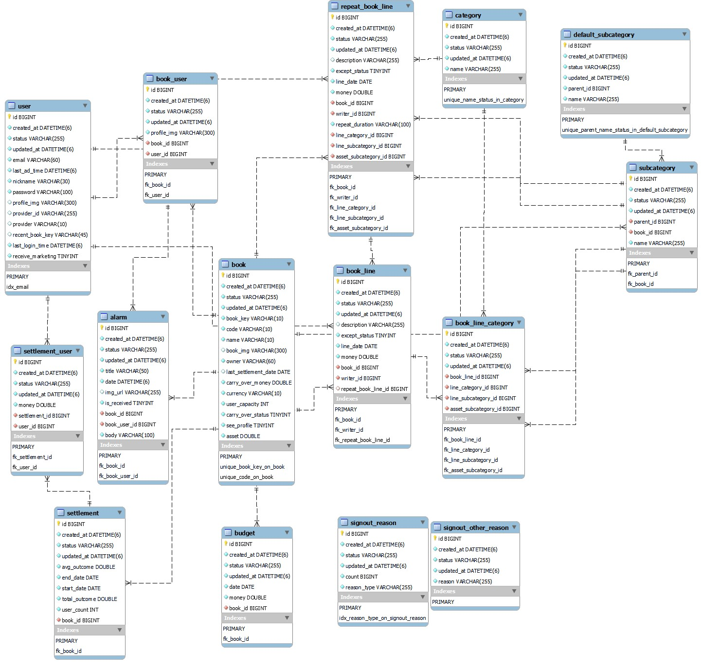

# Server of Floney 🍀

### 함께 기록하는 공유가계부 앱 👩‍👩‍👧‍👧

- 🔗 서비스 소개: https://github.com/Floney-2023
- 🔗 iOS 다운: [앱스토어 링크](https://apps.apple.com/kr/app/%ED%94%8C%EB%A1%9C%EB%8B%88-floney/id6462989500)
- 🔗 안드로이드 다운: 출시 예정

## 시연 영상 🎥

### 가계부 내역 추가

### 가계부 정산

### 가계부 내역 분석

## API 명세서 📝

[🔗 API 명세서 바로가기](https://docs.google.com/spreadsheets/d/1dYrJyME0qMLKuLyS1l5VZkP54tgOKujcHlnroN7nLoA/edit?usp=sharing)

## 시스템 아키텍처 🏗

## ERD 📊

## 팀 컨벤션 👭

### 💫 그냥 작성한 코드는 없다

내가 작성한 모든 코드에 대해 왜 그렇게 작성했는지 얘기할 수 있어야 한다.

### 💫 머지하는 순간 모두의 코드가 된다

남의 코드에서 오류가 발생했다면, 리뷰를 제대로 하지 않은 나의 책임도 있다.  
남의 코드에서 오류가 발생했다면, 함께 원인을 찾고 해결한다.

### 💫 남는 건 기록뿐이다

협업하며 발생한 모든 로그는 프로젝트 레포지토리 및 노션에 기록한다.

### 💫 일정 산출은 신중히, 일정 준수는 무조건

서버팀의 일정은 앱팀과 운영팀에게 영향을 준다.  
따라서 다른 팀과 서비스에 피해를 주지 않도록 신중히 일정을 정하고 지킨다.

### 💫 사람은 실수하지만 테스트 코드는 실수하지 않는다

다양한 테스트를 추가해 서비스의 안정성을 최우선으로 생각한다.
